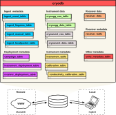
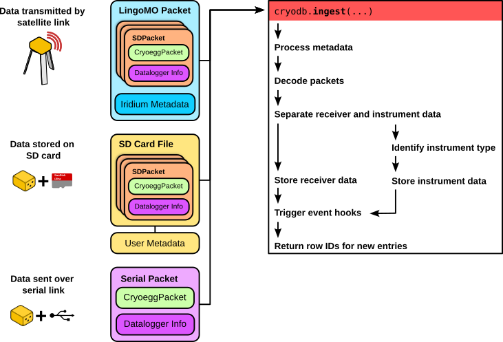

.. cryodb documentation master file, created by
   sphinx-quickstart on Fri Nov  1 11:11:47 2024.
   You can adapt this file completely to your liking, but it should at least
   contain the root `toctree` directive.

cryodb documentation
=====================

Project documentation for cryodb, creating and mantaining MariaDB database for output from CHIL instrumentation.

.. toctree::
   :maxdepth: 2
   :caption: Contents:

   api 

Overview
--------
The cryodb database package provides a wrapper to MariaDB and Sqlite3 databases for storing packets generated by CHIL instrumentation, primarly the Cryoegg and Cryowurst. Additionally, the database provides a repository for instrument, receiver and deployment metadata.

Database structure
^^^^^^^^^^^^^^^^^^
The cryodb database is a hierarchical database which splits data into the following categories:

* **Ingest metadata** is data related to when the instrument data was added to the database.
* **Instrument data** contains both the raw and processed instrument data for the Cryoegg and Cryowurst.
* **Instrument metadata** relates to descriptions of the instruments and their calibration data.
* **Receiver data** contains the processed data from Cryoegg receivers.
* **Receiver metadata** relates to descriptions of the receiver, such as their type and manufacture date.
* **Deployment metadata** contains details of when and where the instruments and receivers have been and are deployed.
* **Other metadata** includes the units metadata table, which describes the units of measurement within the database.

Instances of the database are hosted on a remote server using MariaDB, or stored locally in a flat-file format using Sqlite3.  Local instances of the database are intended to reference and update from a centrally hosted instance, so that instrument and deployment metadata can be kept up to date.

There are multiple sources of input data from instruments and receivers to the database:

* **Satellite** data are packaged by the `Cloudloop <https://www.groundcontrol.com/cloudloop-manage-your-satellite-airtime-online/>`_ Iridium subscription manager into LingoMO packets, which contain the short data burst (SBD) payload.
* **SD Packets** are stored locally to a receiver on the SD card, and are typically ingested as a group from a file.
* **Serial Packets** are transferred over a physical serial (UART or USB) connection to a receiver.

The *ingestion* process for each data source, by which the raw data and associated metadata are inserted into the database, is slightly different; however, a common pattern is outlined in the figure below. 

Development
-----------
Instructions for configuring the development environment for `cryodb` can be found :ref:`here<development_index>`
